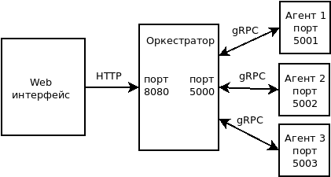
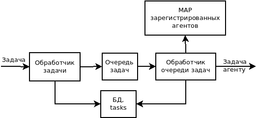

Финальный проект курса обучения Яндекса программированию на языке Go.  
Часть первая. Оркестратор.  
Клонируем в отдельную папку проект  
git clone https://github.com/developerc/finprojorchestr3.git  
Переходим в папку  
cd finprojorchestr3   
Создаем исполняемый файл  
go build  
Исполняемый файл оркестратора можно запускать. Для запуска агента выполнить инструкции во второй части проекта
расположенные здесь: https://github.com/developerc/finprojagent3  
Порядок шагов по запуску сервиса:  
1. Запускаем оркестратор.
2. Запускаем один или несколько агентов.
3. Переходим в браузере по ссылке, регистрируем пользователя, авторизуемся. 
4. Начинаем использовать сервис.  
Для выполнения арифметических вычислений в браузере переходим по ссылке: http://localhost:8080/static/auth.html
Заполняем поля логин, пароль. Регистрируем пользователя. Авторизуемся. Нас перенаправляет на страницу ввода задания.
В поле "Текст задачи" вводим задание. Библиотека, используемая в агенте, выполняет основные арифметические действия над целыми числами и c плавающей запятой: + - * / ^ выражение может содержать круглые скобки. После завершения статус решения будет "finish" или "error" в случае ошибки в вычислениях или некорректном выражении. Статус "start" назначается задаче сразу после отсылки решения. Статус "in_progress" назначается после отсылки агенту.  
Схема взаимодействия частей распределенного калькулятора:  
  
Приложение использует БД SQLite. Файл базы данных store.db можно удалить, при запуске оркестратора он создастся.  
Страница аутентификации. При нажатии на кнопку "Регистрация пользователя" оркестратору отсылается POST запрос с данными логин, пароля нового пользователя. Оркестратор добавляет эти данные в БД и возвращает JSON со статусом результата, который отображается ниже.  
При нажатии на кнопку "Авторизация пользователя" оркестратору отсылается POST запрос с данными логин, пароля. Оркестратор проверяет наличие и правильность, присылает в ответ JSON со статусом результата. Если статус успешный, JWT токен записывается в localStorage и происходит перенаправление на страницу работы с задачей. Там при нажатии на любую кнопку формируется запрос и в headers добавляется заголовок Authorization с полученным токеном. На стороне оркестратора на этапе midleware Authorization производится проверка токена. Если токен соответствует одному из зарегистрированных пользователей, выполняется соответствующая функция. Если нет, возвращается ответ со статусом 401. При получении этого статуса браузер редиректит на страницу авторизации.  
Работа оркестратора.  
  
На схеме показано как задача, пришедшая от браузера, попадает в обработчик задач. Он помещает задачу в очередь задач и добавляет ее в БД в таблицу tasks. В отдельной горутине в бесконечном цикле работает обработчик очереди задач. Если в очереди появилась новая задача, он проверяет MAP с зарегистрированными агентами. Если есть зарегистрированный агент, обработчик отправляет агенту задачу по протоколу gRPC. И если агент принимает задачу к выполнению, обработчик удаляет задачу из очереди и изменяет статус задачи в БД на in_progress.  
Обработка решенных задач.  

Когда агент решил задачу, он по gRPC отсылает оркестратору задачу со статусом "finish" если задача решена правильно или "error" если есть ошибка. Обработчик запроса решенной задачи принимает сообщение и изменяет в БД статус задачи, результат и время решения.  
Когда от браузера по HTTP приходит запрос статуса задачи, он обрабатывается обработчиком который по ID задачи достает из БД эту задачу и отправляет ее в ответе назад браузеру.